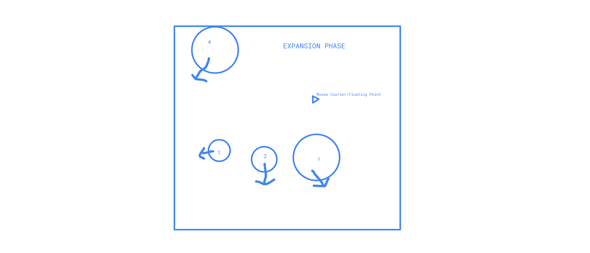
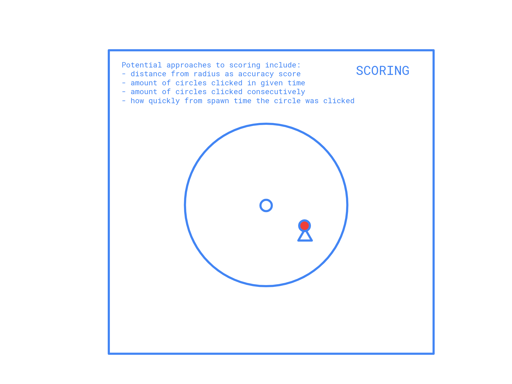
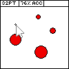
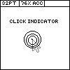

# SEI-Project-OSU-Clone
This is where I am storing my SEI Project One work.

# About The Game:
Do you struggle targeting the right line in your IDE? Can't play first person shooter games very well? Want to increase your actions per minute in starcraft or have no sense of rhythm?
Introducing, SEI-OSU-CLONE, based upon the very popular game OSU which has attracted rhythm game and anime enthusiasts of all stripes across the internet! SEI-OSU-CLONE combines the rhythmic
aspects of a rhythm game, with the speed of an aim training program ensuring that where ever you click, will always be just about right where you want it.

TLDR: Click the circles before the contract into nothingness! You'll be graded upon how many circles you manage to click within a certain time and possibily, how accurate you were to the center!

# Tech Stack:
I believe I have two options here from the draw area:
- I can use p5.js which has a wealth of documentation and graphic capabilities
- I can use HTML5 Canvas which has similar capabilities, with regard to click events, etcetera.

I will be using HTML and CSS to structure and style the page.

# Wireframes:
## EXPANSION PHASE

## CONTRACTION PHASE

## POSSIBLE SCORING MECHANISM

## GAME BOARD

## CLICK INDICATOR

# MVP GOALS
- Create a Start Menu that includes gameplay instructions, and a start button.
- After start button is clicked, it will count down till the game actually starts so user can prepare.
- Render game screen indicating circles clicked, or largest combo. **DONE**
- Render a cursor or cursor indicator on the page. **DONE** <NEED TO FIX OFFSET >
- Random spawning of circles that expand and contract their hitboxes over a set duration. **DONE**
    - When clicked, they dissapear or flash.
- After a set amount of time, i.e. 1 minute, the game ends and the score is displayed.

# STRETCH GOALS
- Make it look nice and come up with general styling outline for graphic enjoyment. 
- Particle effects or an "explosion" for when circles are successfully clicked.
- In addition to the expansion/contraction phase, certain spawned circles should be connected by a "bridge" that takes a mousedown dragging effect.
    - If the cursor leaves the rendered "bridge" between two circles, you cannot proceed with the click-mousedown-drag-click event. If you miss the event, you will only lose the opportunity to have an attached "bonus"
- Accuracy Math to indicate where in the circular or square hitbox you clicked, relative to center of the spawned circle.
- Pattern based spawning of circles, possibly including it in a *map* of possible spawn patterns and randomly choosing one of these patterns.
- Possible music based spawning of circles, i.e. if sound is within a certain frequency range such as a kick drum, it will spawn points. These points will be predetermined/premapped by some function.
    - This could possibly be implemented by having the music be a midi file, and have JS track certain midi events.

 # ROADBLOCKS
 - I predict I will have some difficulty with the collision detection math. I figure I can render the cursor as a "pixel point" i.e. small, and it it finds itself within the circle while it exists, the collision will be detected.
 - Not knowing OOP, I predict I will have difficulty modularizing and extending some of the objects I will be creating.
 - I don't know the full scope of what these rendering frameworks are capable of so I might do something that is not possible within some of them.
 - Not knowing how to register consecutive "events" in the stretch goal such as the 'click-mousedown-drag-click" event.

 - Lay out a grid / so that they can't spawn in the same place.
- start with it being boxes, and as a stretch goal i can make it circle.
- If circles are clicked consecutively, your largest combo is displayed.