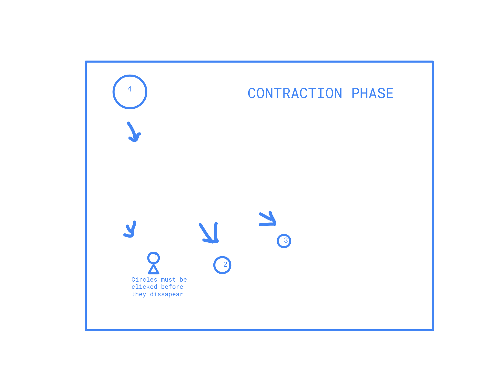

# SEI-Project-OSU-Clone
This is where I am storing my SEI Project One work.

# About The Game:
Do you struggle targeting the right line in your IDE? Can't play first person shooter games very well? Want to increase your actions per minute in starcraft or have no sense of rhythm?
Introducing, SEI-OSU-CLONE, based upon the very popular game OSU which has attracted rhythm game and anime enthusiasts of all stripes across the internet! SEI-OSU-CLONE combines the rhythmic
aspects of a rhythm game, with the speed of an aim training program ensuring that where ever you click, will always be just about right where you want it.

TLDR: Click the circles before the contract into nothingness! You'll be graded upon how many circles you manage to click within a certain time and possibily, how accurate you were to the center!

# Tech Stack:
I believe I have two options here from the draw area:
1 - I can use p5.js which has a wealth of documentation and graphic capabilities
2 - I can use HTML5 Canvas which has similar capabilities, with regard to click events, etcetera.

I will be using HTML and CSS to structure and style the page.

# Wireframes:

